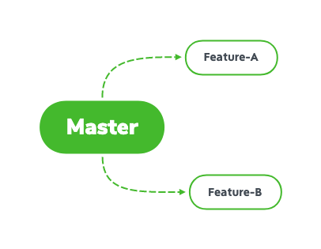
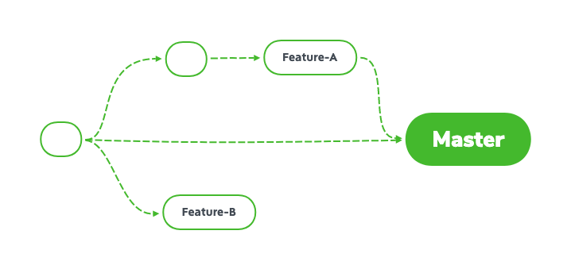
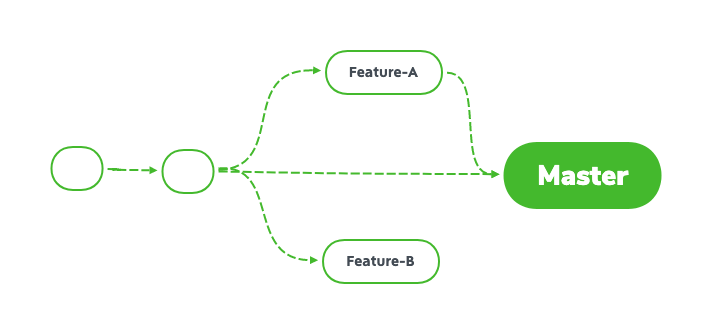
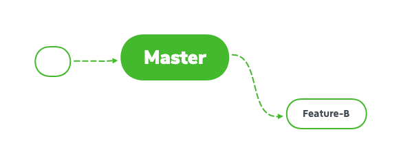
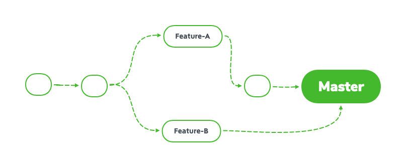

# GitHub学习笔记
## 1. 安装GItHub 参考官方安装文档
### 1.1 初始设置
* 初始化姓名和邮箱地址
```git
git config --global user.name "Your Name"
git config --global user.email "Your Email"
```
这个命令会在“~/.gitconfig”保存

提高命令的可读性
```git 
git config --global color.ui auto
```
## 2. GitHub初体验
### 2.1 账户设置
* 创建账户


* 设置SSH
因为我采用的是Https方式连接，
ssh方式添加请自行百度
### 2.2 上手
* 创建仓库


***


仓库创建好了
通过以下命令添加到本地Git的远程仓库中


拷贝这个仓库地址
通过clone命令将这个仓库克隆到本地
```git
git clone https://github.com/gregrgr6/Hello_World.git
```
让偶进入到这个仓库目录下执行
```
git init 
```
初始化这个仓库
然后通过上面的方式添加姓名和邮箱
将GitHub添加到本地仓库列表，起名为origin
```git
git remote add origin https://github.com/gregrgr6/Hello_World.git
```
* 创建文件
```bash
touch helloworld.txt
```
因为创建的文件还未添加至git仓库所以会出现以下提示

```bash
git status
位于分支 master
未跟踪的文件:
  （使用 "git add <文件>..." 以包含要提交的内容）
	helloworld.txt

提交为空，但是存在尚未跟踪的文件（使用 "git add" 建立跟踪）
```
* 提交
```bash
 git add helloworld.txt
 git commit -m "add file"
[master 727dbe2] add file
 1 file changed, 0 insertions(+), 0 deletions(-)
 create mode 100644 helloworld.txt
```
可以通过git log命令查看提交记录
注：退出按Q
* 进行Push
```bash
git push origin HEAD
```
**注意：如果git之前提交过不同账号的内容，这次须要在.git/config文件中修改**
```bash
url = https://你的github用户名@github.com/Pandaring/Demos.git
```
## 3. 正式开始学习Git
### 3.1 基本操作
* git init --- 初始化仓库
```bash
mkdir git-tutorial
cd git-tutorial
git init
已初始化空的 Git 仓库于 /Volumes/CodeData/GItHub_Studay/git-tutorial/.git/
```
.git目录储存着管理当前目录内容所需要的仓库数据。
在Git中，这个目录被称为“附属于该仓库的工作树”。文件的编辑在工作树中进行，然后记录到仓库中，一次管理文件的历史快照。
* git status --- 查看仓库的状态
我们先查看一下当前状态
```bash
git status
位于分支 master
尚无提交
无文件要提交（创建/拷贝文件并使用 "git add" 建立跟踪）
```
结果显示我们正在master分支下。
建立README.md，为第一次提交做准备。
```bash
touch README.md
git status
位于分支 master
尚无提交
未跟踪的文件:
  （使用 "git add <文件>..." 以包含要提交的内容）
	README.md
提交为空，但是存在尚未跟踪的文件（使用 "git add" 建立跟踪）
```
可以看到 我们刚刚创建的文件出现在了未提交的目下。
* git add --- 向暂存区添加文件
这个操作的目的是为了让文件成为git仓库管理的对象，需要这个命令先将文件加入暂存区
。
```bash
git add README.md
git status
位于分支 master
尚无提交
要提交的变更：
  （使用 "git rm --cached <文件>..." 以取消暂存）
	新文件：   README.md
  ```
将README.md文件加入暂存区后,```git status```显示的结果也发生了变化。
* git commit --- 保存仓库的历史记录
  * 该命令可以将暂存区的文件实际保存到仓库的历史记录。通过这些记录我们就可以复原文件。
  * 记录一行提交信息
    ```bash
    git commit -m "first commit"
      [master（根提交） f14f30f] first commit
      1 file changed, 0 insertions(+), 0 deletions(-)
      create mode 100644 README.md
    ```
    -m 参数后面的“first commit”称为提交信息。
  * 记录详细的提交信息
    忽略-m参数就会出现一个文档编辑，留下变更的信息即可。
  * 终止提交
    将提交信息留空，直接关闭编辑器
  * 查看提交后的状态
    ```bash
    git status
    位于分支 master
    无文件要提交，干净的工作区
    ```
    提交后,暂存区就空了
* git log --- 查看提交的日志
  可以查看以往仓库提交的日志和合并，以及操作前后有什么区别。
  ```bash
  commit f14f30f9bd749c5a42ab0114695296379e77d5d5 (HEAD -> master)
  Author: gregrgr6 <gregrgr6@gmail.com>
  Date:   Sat Feb 22 19:10:51 2020 +0800

    first commit
  ```
  * commit：指向这次提交的哈希值
  * Auther：设置的信息
  * Date：提交执行的时间和日期
* git diff --- 查看更改前后的差别
  可以查看工作树、暂存区、最新提交之间的区别
  向刚刚创建的README.md写点东西
  ```bash
  # Git 教程测试
  ```
  * 查看工作树和暂存区的差别
  ```bash
  git diff  
    diff --git a/README.md b/README.md
    index e69de29..407d688 100644
    --- a/README.md
    +++ b/README.md
    @@ -0,0 +1 @@
    +# Git 教程测试:
  ```
  未使用```git add```将修改后的文件加入暂存区，所以程序只会显示工作树于最新提交之间的区别。
  使用 ```git add```将问价加入暂存区
  ```bash
  git add README.md
  ```
  * 查看工作树和最新提交的区别
  由于工作树和暂存区状态并无区别，所以再次执行```git diff```并不会有任何显示。
  要查看于最新提交的区别执行以下操作。
    ```bash
    git diff HEAD
      diff --git a/README.md b/README.md
      index e69de29..407d688 100644
      --- a/README.md
      +++ b/README.md
      @@ -0,0 +1 @@
      +# Git 教程测试:
    ```
### 3.2 分支的操作
分支的作用主要是满足并行作业。

在不同的分支中可以同时进行完全不同的作业，等待该操作完成后再与master合并。
分支作业完成后的状态如下图所示

* git branch --- 显示分支一览表
  将分支名按列表显示，并且显示当前所在的分支。
  ```bash
  git brabch
    * master
  ```
* git checkout -b --- 创建、切换分支
  以当前的master为基础创建分支
  * 切换到Feature-A分支进行提交
    创建Feature-A的分支
    ```bash
    git checkout -b Feature-A
    切换到一个新分支 'Feature-A'
    ```
    当然也可以用下面这种方式
    ```bash
    git branch Feature-A
    git checkout Feature-A
    ```
  * 切换到master分支
    ```bash
    git checkout master
    ```
    怎么样,是不是简单的要命
* git merge --- 合并分支
  先假设Feature-A已经实现完毕，现在将它合并到master分支中。
  首先切换到master分支
  ```bash
  git checkout master
  ```
  为了在历史记录中记录下本次分支合并，我们需要创建合并提交。在合并时加上--no-ff参数
  ```bash
  git merge --no-ff Feature-A
  ```
  随后编辑器将会启动，用于录入合并信息。
* git log --graph --- 以图标的形式查看分支
  ```bash
  *   commit ec7c2357dbd8ca2e0a1fd39e06e0d5b2379e323f (HEAD -> master)
  |\  Merge: f14f30f 811efed
  | | Author: gregrgr6 <gregrgr6@gmail.com>
  | | Date:   Sat Feb 22 20:33:19 2020 +0800
  | |
  | |     Merge branch 'Feature-A'
  | |     add text
  | |
  | * commit 811efed5460e2595ca6a54937a1b6a782b6b896b (Feature-A)
  |/  Author: gregrgr6 <gregrgr6@gmail.com>
  |   Date:   Sat Feb 22 20:32:31 2020 +0800
  |
  |       Add Text
  |
  * commit f14f30f9bd749c5a42ab0114695296379e77d5d5
    Author: gregrgr6 <gregrgr6@gmail.com>
    Date:   Sat Feb 22 19:10:51 2020 +0800

        first commit
  ```
### 3.3 更改提交的操作
* git reset --- 回撤到历史版本
git的另一个特征就是可以灵活操作历史版本。借助分散仓库对的优势，可以不影响其它仓库的前提下对历史版本进行操作。
这里我们先会带历史版本创建Feature-B分支。

  * 回到Feature-A分支之前
  让仓库的HEAD、暂存区、当前工作树回到指定状态，需要用到```git rest --hard```。只要提供目标时间点的哈希值。
    ```bash
    git reset --hard f14f30f9bd749c5a42ab0114695296379e77d5d5
      HEAD 现在位于 f14f30f first commit
    ```
  * 创建Feature-B分支
    ```bash 
    git checkout -b Feature-B
    ```
    然后在README.md文件中添加
    ```
    # Git 教程
    - Feature-B
    ```
    然后提交文件
    ```bash
    git add README.md
    git commit -m "Feature-B"
    [Feature-B 97ee5af] Feature-B
    1 file changed, 2 insertions(+)
    ```
    现在的状态如下图所示
    
    我们接下来要修改成如下图所示
    
  * 推进至Feature-A分支合并后的状态
  执行```git reflog```
    ```bash
    97ee5af (HEAD -> Feature-B) HEAD@{0}: commit: Feature-B
    f14f30f (master) HEAD@{1}: checkout: moving from master to Feature-B
    f14f30f (master) HEAD@{2}: reset: moving to f14f30f9bd749c5a42ab0114695296379e77d5d5
    811efed (Feature-A) HEAD@{3}: reset: moving to 811efed5460e2595ca6a54937a1b6a782b6b896b
    ec7c235 HEAD@{4}: merge Feature-A: Merge made by the 'recursive' strategy.
    f14f30f (master) HEAD@{5}: checkout: moving from Feature-A to master
    811efed (Feature-A) HEAD@{6}: checkout: moving from Feature-A to Feature-A
    811efed (Feature-A) HEAD@{7}: commit: Add Text
    f14f30f (master) HEAD@{8}: checkout: moving from master to Feature-A
    f14f30f (master) HEAD@{9}: checkout: moving from Feature-A to master
    f14f30f (master) HEAD@{10}: checkout: moving from master to Feature-A
    f14f30f (master) HEAD@{11}: commit (initial): first commit
    ```
  可以看到每条命令的执行记录
  我们将HEAD、暂存区、工作树恢复到合并时间点时候
  ```bash
  git checkout master
    切换到分支 'master'
  git reset --hard ec7c235
    HEAD 现在位于 ec7c235 Merge branch 'Feature-A' add text
  ```
  * 消除冲突
  现在只要合并Feature-B分支，就可以得到我们想要的状态。
    ```bash
    git merge --no-ff Feature-B
    自动合并 README.md
    冲突（内容）：合并冲突于 README.md
    自动合并失败，修正冲突然后提交修正的结果。
    ```
  * 查看冲突部分并将其解决
  修改合并文件内容成自己想要的结果即可。
  * 提交解决后的结果
  ```bash
  git add README.md
  git commit -m "Fix conflict"
  ```
* git commit --amend --- 修改提交的信息
  执行```git commit --amend```编辑器就会启动
  我们将修改的内容修改为“Merge branch "Funture-B"”
  再用```git log --graph```就可以看到修改的历史
    ```bash
    *   commit bdfb09b1d35fa71fd691112f616a1419f04dd75e (HEAD -> master)
    |\  Merge: ec7c235 97ee5af
    | | Author: gregrgr6 <gregrgr6@gmail.com>
    | | Date:   Sun Feb 23 12:30:30 2020 +0800
    | |
    | |     Merge branch "Funture-B"
    | |
    | * commit 97ee5afd8aa6bf60067f788e8a630e691feb0b69 (Feature-B)
    | | Author: gregrgr6 <gregrgr6@gmail.com>
    | | Date:   Sun Feb 23 10:27:31 2020 +0800
    | |
    | |     Feature-B
    | |
    * |   commit ec7c2357dbd8ca2e0a1fd39e06e0d5b2379e323f
    |\ \  Merge: f14f30f 811efed
    | |/  Author: gregrgr6 <gregrgr6@gmail.com>
    |/|   Date:   Sat Feb 22 20:33:19 2020 +0800
    | |
    | |       Merge branch 'Feature-A'
    | |       add text
    | |
    | * commit 811efed5460e2595ca6a54937a1b6a782b6b896b (Feature-A)
    |/  Author: gregrgr6 <gregrgr6@gmail.com>
    |   Date:   Sat Feb 22 20:32:31 2020 +0800
    ```
* git rebase -i --- 压缩历史
在合并分支之前，如果发现已提交的内容中有些拼写错误，可以提交一个修改将这个修改包含到前一个提交之中，压缩成一个历史记录。
  * 创建一个分支
  ```bash
  git checkout -b Feature-C
  ```
  然后将文件README.md修改如下
  ```
  # Git 教程
  - Feature-B
  - Feature-A
  - Feature-C
  ```
  执行一步提交
  ```bash
  git commit -am "Add Feature-C"
  ```
  * 修正拼写错误
  将README.md修改成下图所示
    ```
    diff --git a/README.md b/README.md
    index 4808ab1..b3d13af 100644
    --- a/README.md
    +++ b/README.md
    @@ -1,4 +1,4 @@
    # Git 教程
    - Feature-B
    - Feature-A
    -- Feature-C
    +- Faeture-C
    ```
  然后进行提交
  ```
  git commit -am "Fix typo"
    [Feature-C 3d6912f] Fix typo
    1 file changed, 1 insertion(+), 1 deletion(-)
  ```
  * 更改历史
  ```bash
  git rebase -i HEAD~2
  ```
  执行上述命令之后，可以选定当前分支中包含的两个最新历史为对象，并在编辑器当中打开
  ```base 
  pick 35ea826 Add Feature-C
  pick 3d6912f Fix typo

  # 变基 bdfb09b..3d6912f 到 bdfb09b（2 个提交）
  #
  # 命令:
  # p, pick <提交> = 使用提交
  # r, reword <提交> = 使用提交，但修改提交说明
  # e, edit <提交> = 使用提交，进入 shell 以便进行提交修补
  # s, squash <提交> = 使用提交，但融合到前一个提交
  # f, fixup <提交> = 类似于 "squash"，但丢弃提交说明日志
  # x, exec <命令> = 使用 shell 运行命令（此行剩余部分）
  # b, break = 在此处停止（使用 'git rebase --continue' 继续变基）
  # d, drop <提交> = 删除提交
  # l, label <label> = 为当前 HEAD 打上标记
  # t, reset <label> = 重置 HEAD 到该标记
  # m, merge [-C <commit> | -c <commit>] <label> [# <oneline>]
  # .       创建一个合并提交，并使用原始的合并提交说明（如果没有指定
  # .       原始提交，使用注释部分的 oneline 作为提交说明）。使用
  # .       -c <提交> 可以编辑提交说明。
  #
  # 可以对这些行重新排序，将从上至下执行。
  #
  # 如果您在这里删除一行，对应的提交将会丢失。
  ```
  将第二行左侧的pick改为fixup
  这样之前的历史就被抹去了
  * 合并至master分支
  